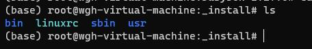

## 0、环境准备
ubuntu20.04 操作系统提前安装 clang llvm 12以上版本  

```
apt install -y bison build-essential cmake flex git libedit-dev \
  libllvm12 llvm-12-dev libclang-12-dev python zlib1g-dev libelf-dev libfl-dev 
```
安装完成后，默认的命令是clang-12和clang++-12，需要使用update-alternatives来设置成clang和clang++：
```
update-alternatives --install /usr/bin/clang clang /usr/bin/clang-12 1 --slave /usr/bin/clang++ clang++ /usr/bin/clang++-12
```

## 1、拉取rust_for_linux 代码

```
git clone https://github.com/Rust-for-Linux/linux.git
```
后续rust合并到linux主分支 可以拉取 https://github.com/torvalds/linux.git


## 2、设置rust 环境
```
rustup override set $(scripts/min-tool-version.sh rustc)
rustup component add rust-src
```
## 3、编译linux内核
在 kernel/config/qemu-busybox-min.config 添加如下配置，让内核支持内核模块开发
```
CONFIG_MODULES=y
```

配置内核参数
```
make allnoconfig x86_64_defconfig qemu-busybox-min.config rust.config
```


编译内核
```
make CC=clang
```
编译完成如图: 会在 /linux/arch/x86/boot/bzImage 生成内核镜像文件  

## 4、制作根文件系统
到busybox[官网](https://busybox.net/downloads/)下载busybox-1.27.0.tar.bz2  
解压tar xvf busybox-1.27.0.tar.bz2
输入 ```make defconfig``` 进行配置  
接下来输入 ```make menuconfig```，在默认配置的基础上进行定制：
```
# menuconfig begin
Settings -->
    [*] Build static binary (no shared libs)
# menuconfig end
```


编译
```
make -j4
```
安装
```
make install
```
编译后会在 ./_install的目录下生成各种命令。分别放到了4个文件bin linuxrc sbin usr里  


## 5、用qemu启动内核
使用 qemu-img 创建一个 512M 的磁盘镜像文件：
```
qemu-img create -f raw disk.raw 512M
```
现在 disk.raw 文件就相当于一块磁盘，为了在里面存储文件，需要先进行格式化，创建文件系统。比如在 Linux 系统中使用 ext4 文件系统进行格式化
```
mkfs -t ext4 ./disk.raw
```
挂载磁盘镜像文件  
格式化完成之后，可以在 Linux 系统中以 loop 方式将磁盘镜像文件挂载到一个目录上，这样就可以操作磁盘镜像文件中的内容了。
下面的命令将磁盘镜像文件挂载到 /mnt/rootfs/ 目录上：
```
mount -o loop ./disk.raw /mnt/rootfs/
```
现在可以将之前编译好的linux内核模块安装到磁盘镜像中了。命令如下：
```
make modules_install INSTALL_MOD_PATH=/mnt/rootfs
```
执行完成后即可在 /mnt/rootfs 下看到安装好的内核模块。

busybox 安装完成之后，使用内核启动参数 init= 来指定 busybox 作为 init 程序
```
qemu-system-x86_64 -m 1G -nographic -kernel  ../linux/arch/x86/boot/bzImage  -nographic -append "init=/linuxrc root=/dev/sda" -drive format=raw,file=./disk.raw 
```
内核成功找到了 init 程序并且创建出 init 进程，但是 init 执行过程中出现如下报错

```
can't run '/etc/init.d/rcS': No such file or directory

can't open /dev/tty3: No such file or directory
can't open /dev/tty4: No such file or directory
```
并且根据配置，我们创建可执行文件 /etc/init.d/rcS, 内容如下
```
#!/bin/sh
```
配置完成以后再次尝试启动，这次将成功启动，并且出现如下提示：
```
Please press Enter to activate this console.
```
进入内核可以看完一个完整的操作系统  


挂载 /dev, /proc, /sys 文件系统
查看当前系统环境，会发现当前文件系统结构是不完整的。比如没有 /dev, /proc 以及 /sys 挂载点。这样我们无法通过 /dev 查看系统中的设备，如果执行 df 命令也会因为没有 /proc 挂载点而报错：
```
df: /proc/mounts: No such file or directory
```
因此，我们需要手工创建 /dev, /proc, /sys 这三个目录。/dev 目录创建完成后重启系统即可工作，但 /proc 和 /sys 需要执行挂载才可工作，可以将 /proc 和 /sys 的挂载动作放到 /etc/init.d/rcS 中，每次系统启动时自动挂载。修改 /etc/init.d/rcS 内容如下

```
#!/bin/sh
mount -t proc proc /proc
mount -t sysfs sysfs /sys
```
重新启动系统查看，可以看到 /dev, /proc, /sys 挂载点都相应有了内容。  


### 6、编写hello内核模块并运行

main.rs 文件
```rust 
#![allow(missing_docs)]

use kernel::prelude::*;
use kernel::{str::CStr, ThisModule};

module! {
        type: HelloWorld,
        name: "hello_world",
        author: "Douglas Su",
        description: "A simple hello world example",
        license: "GPL v2",
}

struct HelloWorld;

impl kernel::Module for HelloWorld {
    fn init(_name: &'static CStr, _module: &'static ThisModule) -> Result<Self> {
        pr_info!("Hello world from rust!\n");
        Ok(HelloWorld)
    }
}

impl Drop for HelloWorld {
    fn drop(&mut self) {
        pr_info!("Bye world from rust!\n");
    }
}
```

Makefile文件
``` makefile
hello_world-objs := main.o
obj-m := hello_world.o


PWD := $(shell pwd)

modules:
    make -C /opt/cproject/linux M=$(PWD) LLVM=1 modules


clean:
    make -C /opt/cproject/linux M=$(PWD) clean
```
执行 make


产生 hello_world.ko 文件，讲hello_world.ko 文件复制到根文件系统中，如图：  
  

接下来可以运行加载内核模块那样 加载 hello_world.ko 文件
```
insmod hello_world.ko
```
  

至此，rust开发内核模块环境搭建完成，后续我们可以开始内核文件系统的开发了


